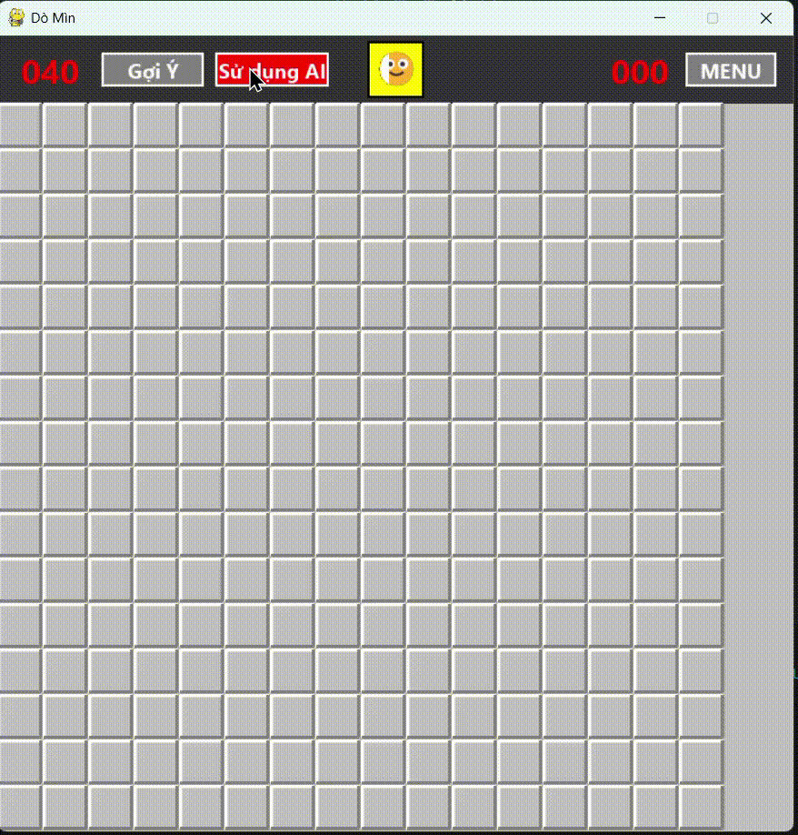

# 🤖 MinesweeperAI

**Mô tả:**  
MinesweeperAI là một dự án trí tuệ nhân tạo giúp chơi trò dò mìn (Minesweeper) bằng cách sử dụng **lập luận logic và mệnh đề suy luận** để xác định các ô an toàn và vị trí có mìn.  

**Description:**  
MinesweeperAI is an AI project that plays the classic Minesweeper game using **logical reasoning and propositional inference** to determine safe cells and mine locations.

---

# 🧠 Tính năng | Features
- Tự động giải trò chơi Minesweeper bằng các quy tắc logic.  
- Fully automated Minesweeper solver using logical inference.  

- Xác định các ô an toàn và các ô chứa mìn dựa trên thông tin từ bàn cờ.  
- Identifies safe and mined cells based on board information.  

---

# 🧩 Cấu trúc dự án | Project structure:
| **Tệp**       | **Mô tả** |
|----------------|-----------|
| `main.py`      | Tệp chạy chính. Điều phối vòng lặp game (Menu ↔ Game). |
| `UI.py`   | **Giao Diện (UI)**. Chứa toàn bộ code Pygame, vẽ bàn cờ, header, và menu cài đặt. |
| `Game.py`      | **Logic Game**. Chứa lớp `Minesweeper` quản lý trạng thái bàn cờ, luật chơi, kiểm tra thắng/thua. |
| `AI.py`        | **Logic AI**. Chứa lớp `AI` và `Statement`, chịu trách nhiệm xây dựng tri thức và suy luận. |

---

| **File**       | **Description** |
|----------------|-----------------|
| `main.py`      | Main entry point. Controls the game loop (Menu ↔ Game). |
| `game_ui.py`   | **User Interface (UI)**. Contains all Pygame code for drawing the board, header, and settings menu. |
| `Game.py`      | **Game Logic**. Contains the `Minesweeper` class that manages the board state, rules, and win/loss conditions. |
| `AI.py`        | **AI Logic**. Contains the `AI` and `Statement` classes, responsible for building knowledge and reasoning. |


---

# 🎮 Demo
<br />



---

# 🚀 Tải dự án về máy | Clone this repo
```bash
git clone https://github.com/phoret17/MinesweeperAI-.git
cd MinesweeperAI-
```

# 📦 Cài đặt thư viện cần thiết | Install dependencies
```bash
pip install pygame
```

# ▶️ Chạy dự án | Run the project
```bash
python main.py
```

